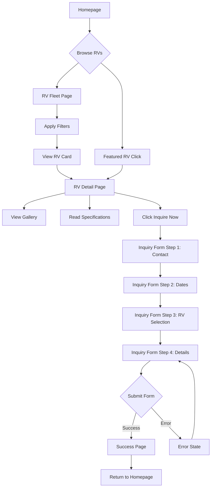

# Happy Campers RV Rental Platform - IDE-Ready Front-End System Brief

## 1. System Overview

### 1.1 Core Design Philosophy
The Happy Campers platform is an inquiry-focused system designed to generate leads rather than manage bookings. The design philosophy centers on:
- **Trust Through Simplicity**: Clean, professional interface that builds confidence
- **Frictionless Inquiry Generation**: Minimal barriers to submitting rental requests
- **Visual Storytelling**: High-quality imagery driving emotional connection
- **Mobile-First Responsive**: Seamless experience across all devices
- **Accessibility First**: WCAG AA compliant for inclusive design

### 1.2 Technical Architecture
```
Frontend Stack:
├── Framework: Next.js 14+ (App Router)
├── Styling: Tailwind CSS + shadcn/ui
├── State Management: React Context + Zustand
├── Forms: React Hook Form + Zod
├── API Client: Axios with interceptors
├── Analytics: Google Analytics 4
└── Error Tracking: Sentry

Responsive Breakpoints:
├── Mobile: 320px - 767px
├── Tablet: 768px - 1023px
├── Desktop: 1024px - 1439px
└── Wide: 1440px+
```

### 1.3 Design System Foundation
```css
/* Color Palette - Based on happycampersrvrentals.com */
:root {
  /* Primary Colors */
  --primary-green: #2B5F3F;      /* Forest green from logo */
  --primary-orange: #F26522;     /* Vibrant orange accent */
  
  /* Secondary Colors */
  --secondary-brown: #8B6F47;    /* Warm earth tone */
  --secondary-beige: #F5E6D3;    /* Light background */
  --secondary-sky: #87CEEB;      /* Sky blue for highlights */
  
  /* Neutral Colors */
  --neutral-900: #1A1A1A;        /* Near black for text */
  --neutral-700: #4A4A4A;        /* Dark gray */
  --neutral-500: #737373;        /* Medium gray */
  --neutral-300: #D1D1D1;        /* Light gray */
  --neutral-100: #F7F7F7;        /* Off white */
  --white: #FFFFFF;
  
  /* Semantic Colors */
  --success: #10B981;            /* Green for success states */
  --warning: #F59E0B;            /* Amber for warnings */
  --error: #EF4444;              /* Red for errors */
  --info: #3B82F6;               /* Blue for information */
  
  /* Typography Scale */
  --font-family-primary: 'Inter', sans-serif;
  --font-family-heading: 'Poppins', sans-serif;
  
  /* Font Sizes - Mobile First */
  --text-xs: clamp(0.75rem, 2vw, 0.875rem);
  --text-sm: clamp(0.875rem, 2.5vw, 1rem);
  --text-base: clamp(1rem, 3vw, 1.125rem);
  --text-lg: clamp(1.125rem, 3.5vw, 1.25rem);
  --text-xl: clamp(1.25rem, 4vw, 1.5rem);
  --text-2xl: clamp(1.5rem, 5vw, 2rem);
  --text-3xl: clamp(1.875rem, 6vw, 2.5rem);
  --text-4xl: clamp(2.25rem, 7vw, 3rem);
  
  /* Spacing System */
  --space-xs: 0.25rem;
  --space-sm: 0.5rem;
  --space-md: 1rem;
  --space-lg: 1.5rem;
  --space-xl: 2rem;
  --space-2xl: 3rem;
  --space-3xl: 4rem;
  
  /* Border Radius */
  --radius-sm: 0.25rem;
  --radius-md: 0.5rem;
  --radius-lg: 1rem;
  --radius-xl: 1.5rem;
  --radius-full: 9999px;
  
  /* Shadows */
  --shadow-sm: 0 1px 2px rgba(0, 0, 0, 0.05);
  --shadow-md: 0 4px 6px rgba(0, 0, 0, 0.1);
  --shadow-lg: 0 10px 15px rgba(0, 0, 0, 0.1);
  --shadow-xl: 0 20px 25px rgba(0, 0, 0, 0.15);
}
```

## 2. Page Architecture & State Documentation

### 2.1 Complete Page Inventory

With individual RV pages, the total page count is now approximately 33 customer-facing pages (including 10 individual RV pages) and 11 admin pages.

#### Customer-Facing Pages
1. **Homepage** (`/`)
   - Hero section with video/image carousel
   - Featured RVs showcase
   - Trust indicators (years in business, happy customers)
   - Testimonials carousel
   - CTA sections

2. **RV Fleet Page** (`/rv-rentals`)
   - Grid/List view toggle
   - Advanced filtering sidebar
   - Quick search bar
   - Results count and sorting
   - Pagination or infinite scroll

3. **RV Detail Pages** (Individual pages for each RV)
   - **2024 Entegra Ethos 20D** (`/rv-rentals/2024-entegra-ethos-20d`)
   - **2024 Entegra Ethos 20T** (`/rv-rentals/2024-entegra-ethos-20t`)
   - **2023 Thor Twist 2AB** (`/rv-rentals/2023-thor-twist-2ab`)
   - **2022 Forest River Sunseeker 3250DS LE** (`/rv-rentals/2022-forest-river-sunseeker-3250ds-le`)
   - **2022 Forest River Sunseeker 2850S LE** (`/rv-rentals/2022-forest-river-sunseeker-2850s-le`)
   - **2022 Forest River Sunseeker 2440DS** (`/rv-rentals/2022-forest-river-sunseeker-2440ds`)
   - **2022 Forest River Sunseeker 2860DS** (`/rv-rentals/2022-forest-river-sunseeker-2860ds`)
   - **2021 Winnebago Minnie Winnie 31K** (`/rv-rentals/2021-winnebago-minnie-winnie-31k`)
   - **2021 Winnebago Minnie Winnie 22M** (`/rv-rentals/2021-winnebago-minnie-winnie-22m`)
   - **2021 Winnebago Minnie Winnie 31H** (`/rv-rentals/2021-winnebago-minnie-winnie-31h`)
   - **Additional RV pages as fleet expands**
   
   Each RV detail page includes:
   - Image gallery with lightbox
   - Specifications tabs
   - Inquiry form sidebar
   - Similar RVs section
   - Customer reviews
   - Unique SEO content for each model

4. **About Us Page** (`/about`)
   - Company story
   - Team showcase
   - Mission/Values
   - Why Choose Us section

5. **Blog Hub** (`/blog`)
   - Article grid
   - Categories sidebar
   - Search functionality
   - Featured posts

6. **Blog Article** (`/blog/[slug]`)
   - Article content
   - Author bio
   - Related articles
   - Social sharing

7. **Contact Page** (`/contact`)
   - Contact form
   - Business information
   - Interactive map
   - FAQ accordion

8. **Testimonials Page** (`/testimonials`)
   - Review cards grid
   - Filter by RV type
   - Rating distribution

9. **Privacy Policy** (`/privacy-policy`)
   - Legal content
   - Table of contents
   - Print-friendly layout

10. **Sitemap** (`/sitemap`)
    - Hierarchical link structure
    - XML sitemap generation

11. **404 Error Page** (`/404`)
    - Friendly error message
    - Search functionality
    - Popular RVs links

12. **500 Error Page** (`/500`)
    - System error message
    - Contact information
    - Home navigation

#### Admin Pages
1. **Login** (`/admin/login`)
2. **Dashboard** (`/admin`)
3. **Inquiries** (`/admin/inquiries`)
4. **Inquiry Detail** (`/admin/inquiries/[id]`)
5. **RV Management** (`/admin/rvs`)
6. **RV Editor** (`/admin/rvs/[id]`)
7. **Content Management** (`/admin/content`)
8. **Blog Management** (`/admin/blog`)
9. **Reviews Management** (`/admin/reviews`)
10. **Users Management** (`/admin/users`)
11. **Reports** (`/admin/reports`)
12. **Settings** (`/admin/settings`)

### 2.2 Comprehensive State Catalog

#### Global Application States
```typescript
interface GlobalState {
  // Navigation States
  mobileMenuOpen: boolean;
  adminSidebarCollapsed: boolean;
  
  // Search States
  searchQuery: string;
  searchFilters: FilterState;
  searchResults: RV[];
  searchLoading: boolean;
  
  // UI States
  theme: 'light' | 'dark' | 'system';
  toasts: Toast[];
  modals: ModalState[];
}
```

#### Page-Specific States

**Homepage States**
```typescript
interface HomepageState {
  hero: {
    currentSlide: number;
    isPlaying: boolean;
    loaded: boolean;
  };
  featuredRVs: {
    data: RV[];
    loading: boolean;
    error: string | null;
  };
  testimonials: {
    currentIndex: number;
    autoplay: boolean;
  };
}
```

**RV Fleet Page States**
```typescript
interface FleetPageState {
  // View States
  viewMode: 'grid' | 'list';
  
  // Filter States
  filters: {
    type: string[];
    sleepingCapacity: number[];
    priceRange: [number, number];
    amenities: string[];
  };
  
  // Results States
  results: {
    rvs: RV[];
    totalCount: number;
    currentPage: number;
    loading: boolean;
    error: string | null;
  };
  
  // Sort State
  sortBy: 'price_asc' | 'price_desc' | 'name' | 'capacity';
  
  // No Results State
  noResultsShowing: boolean;
  suggestions: RV[];
}
```

**RV Detail Page States**
```typescript
interface RVDetailState {
  // Gallery States
  gallery: {
    currentImage: number;
    lightboxOpen: boolean;
    thumbnailsVisible: boolean;
    zoomLevel: number;
  };
  
  // Tab States
  activeTab: 'overview' | 'specifications' | 'amenities' | 'reviews';
  
  // Inquiry Form States
  inquiryForm: {
    step: 1 | 2 | 3 | 4;
    data: InquiryFormData;
    validation: ValidationErrors;
    submitting: boolean;
    submitted: boolean;
    error: string | null;
  };
  
  // Content States
  rv: RV | null;
  loading: boolean;
  error: string | null;
  similarRVs: RV[];
}
```

**Inquiry Form States**
```typescript
interface InquiryFormState {
  // Multi-step form states
  currentStep: number;
  maxStepReached: number;
  
  // Form data states
  formData: {
    // Step 1: Contact
    firstName: string;
    lastName: string;
    email: string;
    phone: string;
    
    // Step 2: Trip Details
    startDate: Date | null;
    endDate: Date | null;
    flexibleDates: boolean;
    
    // Step 3: RV Selection
    selectedRV: string;
    alternativeRVs: string[];
    
    // Step 4: Additional Info
    numberOfTravelers: number;
    tripDetails: string;
    specialRequirements: string;
  };
  
  // Validation states
  errors: Record<string, string>;
  touched: Record<string, boolean>;
  
  // Submission states
  isSubmitting: boolean;
  submitSuccess: boolean;
  submitError: string | null;
  
  // UI states
  showDatePicker: boolean;
  showRVSelector: boolean;
}
```

**Admin Dashboard States**
```typescript
interface AdminDashboardState {
  // Statistics States
  stats: {
    newInquiriesToday: number;
    newInquiriesWeek: number;
    newInquiriesMonth: number;
    pendingFollowUps: number;
    activeRentals: number;
    loading: boolean;
  };
  
  // Activity Feed States
  activityFeed: {
    items: Activity[];
    loading: boolean;
    hasMore: boolean;
    page: number;
  };
  
  // Notification States
  notifications: {
    unread: number;
    items: Notification[];
    soundEnabled: boolean;
  };
}
```

#### Component-Level States

**Image Gallery Component States**
```typescript
interface ImageGalleryState {
  // View states
  currentIndex: number;
  viewMode: 'grid' | 'carousel' | 'lightbox';
  
  // Loading states
  imagesLoaded: boolean[];
  loadingImage: number | null;
  
  // Interaction states
  isDragging: boolean;
  dragStartX: number;
  dragCurrentX: number;
  
  // Zoom states
  isZoomed: boolean;
  zoomLevel: number;
  panPosition: { x: number; y: number };
  
  // Error states
  failedImages: number[];
  showPlaceholder: boolean;
}
```

**Filter Component States**
```typescript
interface FilterComponentState {
  // Expansion states
  expandedSections: string[];
  
  // Selection states
  tempSelections: FilterSelections;
  appliedSelections: FilterSelections;
  
  // UI states
  isSticky: boolean;
  isMobileDrawerOpen: boolean;
  
  // Reset state
  hasChanges: boolean;
}
```

**Form Field States**
```typescript
interface FormFieldState {
  value: any;
  error: string | null;
  touched: boolean;
  focused: boolean;
  validating: boolean;
  pristine: boolean;
}
```

### 2.4 Individual RV Page Specifications

#### RV-Specific Content Strategy
```typescript
interface RVPageContent {
  // Common structure for all RV pages
  common: {
    header: 'Standard navigation',
    gallery: 'RV-specific images',
    specifications: 'Model-specific data',
    inquiryForm: 'Pre-populated with RV selection',
    reviews: 'Filtered to this RV model',
    footer: 'Standard footer'
  };
  
  // Unique content per RV
  unique: {
    heroTitle: string;
    metaDescription: string;
    highlights: string[];
    idealFor: string[];
    whyChooseThis: string;
    detailedDescription: string;
  };
}

// Example: 2024 Entegra Ethos 20D Page
const EntegrEthos20D = {
  url: '/rv-rentals/2024-entegra-ethos-20d',
  
  seo: {
    title: '2024 Entegra Ethos 20D Rental | Compact Luxury RV | Happy Campers',
    description: 'Rent the 2024 Entegra Ethos 20D - premium compact Class B+ motorhome in Bend, OR. Mercedes chassis, diesel efficiency, sleeps 4. Perfect for couples seeking luxury.',
    keywords: ['entegra ethos 20d', 'class b plus rv rental', 'mercedes rv rental', 'luxury compact rv']
  },
  
  content: {
    heroTitle: '2024 Entegra Ethos 20D',
    tagline: 'Compact Luxury on a Mercedes Chassis',
    
    highlights: [
      'Built on Mercedes-Benz Sprinter chassis',
      'Diesel engine for superior fuel efficiency',
      'Premium interior finishes',
      'Murphy bed for versatile living space',
      'All-season capability'
    ],
    
    idealFor: [
      'Couples seeking luxury',
      'Fuel-conscious travelers',
      'Easy parking and maneuverability',
      'Year-round adventures'
    ],
    
    whyChooseThis: 'The Entegra Ethos 20D represents the pinnacle of compact luxury RVs. Built on the reliable Mercedes-Benz Sprinter chassis, it offers car-like driving with motorhome amenities.',
    
    specifications: {
      dimensions: {
        length: "20' 11\"",
        width: "7' 6\"",
        height: "10' 7\"",
        wheelbase: "144\""
      },
      capacity: {
        sleeps: 4,
        seatbelts: 4,
        freshWater: '23 gal',
        grayWater: '23 gal',
        blackWater: '23 gal',
        propane: '9.2 gal',
        fuel: '24.5 gal'
      },
      features: {
        chassis: 'Mercedes-Benz Sprinter 3500',
        engine: 'Diesel 2.0L Turbo',
        generator: 'Onan 2800W',
        ac: '11,000 BTU',
        awning: '10 ft power'
      }
    }
  }
};

// 2021 Winnebago Minnie Winnie 22M Page
const WinnebagoMinnieWinnie22M = {
  url: '/rv-rentals/2021-winnebago-minnie-winnie-22m',
  
  seo: {
    title: '2021 Winnebago Minnie Winnie 22M Rental | Family Class C RV | Happy Campers',
    description: 'Rent the 2021 Winnebago Minnie Winnie 22M Class C motorhome in Bend, OR. Perfect for families, sleeps 6 with queen bed slideout. Your adventure awaits!',
    keywords: ['winnebago minnie winnie 22m', 'class c rv rental', 'family rv rental bend']
  },
  
  content: {
    heroTitle: '2021 Winnebago Minnie Winnie 22M',
    tagline: 'Family-Friendly Comfort & Reliability',
    
    highlights: [
      'Sleeps up to 6 comfortably',
      'Queen bed slideout for extra space',
      'Full kitchen and bathroom',
      'Easy to drive Class C motorhome',
      'Perfect for national park access'
    ]
  }
};

// 2022 Forest River Sunseeker 3250DS LE Page
const ForestRiverSunseeker3250DS = {
  url: '/rv-rentals/2022-forest-river-sunseeker-3250ds-le',
  
  seo: {
    title: '2022 Forest River Sunseeker 3250DS LE Rental | Bunkhouse RV | Happy Campers',
    description: 'Rent the 2022 Forest River Sunseeker 3250DS LE bunkhouse motorhome. Sleeps 10 with dedicated kids area, perfect for large families exploring Oregon.',
    keywords: ['forest river sunseeker 3250ds', 'bunkhouse rv rental', 'large family rv']
  },
  
  content: {
    heroTitle: '2022 Forest River Sunseeker 3250DS LE',
    tagline: 'Ultimate Bunkhouse for Large Families',
    
    highlights: [
      'Sleeps up to 10 people',
      'Dedicated bunkhouse for kids',
      'Rear queen bedroom with slideout',
      'Exterior entertainment center',
      'Massive storage capacity'
    ]
  }
};
```

#### RV Page State Management
```typescript
interface RVPageState {
  // Individual RV page states
  rvData: {
    details: RV;
    loading: boolean;
    error: string | null;
  };
  
  // Gallery state specific to this RV
  gallery: {
    images: string[];
    currentIndex: number;
    lightboxOpen: boolean;
  };
  
  // Reviews filtered for this RV
  reviews: {
    items: Review[];
    averageRating: number;
    totalCount: number;
    currentPage: number;
  };
  
  // Pre-populated inquiry form
  inquiryForm: {
    preselectedRV: string;
    formData: InquiryFormData;
    currentStep: number;
  };
  
  // Similar RVs (same class or capacity)
  similarRVs: {
    items: RV[];
    loading: boolean;
  };
  
  // Seasonal pricing display
  pricing: {
    currentSeason: 'summer' | 'winter' | 'spring_fall';
    displayPrice: number;
    allSeasons: SeasonalPricing;
  };
}
```

#### Dynamic RV Page Generation Pattern
```typescript
// Pattern for generating RV pages from admin data
const RVPageGenerator = {
  // Template for creating new RV pages
  createPage: (rv: RV) => ({
    path: `/rv-rentals/${rv.slug}`,
    
    generateSEO: () => ({
      title: `${rv.name} Rental | ${rv.type} | Happy Campers`,
      description: rv.seoMetadata.description || generateDefaultDescription(rv),
      keywords: rv.seoMetadata.keywords || generateDefaultKeywords(rv),
      
      structuredData: {
        "@context": "https://schema.org",
        "@type": "Product",
        "name": rv.name,
        "description": rv.description,
        "image": rv.images.primary,
        "offers": {
          "@type": "AggregateOffer",
          "priceCurrency": "USD",
          "lowPrice": rv.pricing.winter,
          "highPrice": rv.pricing.summer,
          "availability": "https://schema.org/InStock"
        }
      }
    }),
    
    generateContent: () => ({
      // Auto-generate content sections from RV data
      heroSection: {
        title: rv.name,
        subtitle: rv.tagline || `${rv.type} - Sleeps ${rv.sleepingCapacity}`,
        primaryImage: rv.images.primary,
        ctaText: 'Check Availability'
      },
      
      // Map amenities to feature highlights
      highlights: generateHighlights(rv.amenities, rv.specifications),
      
      // Generate "ideal for" based on capacity and features
      idealFor: generateIdealFor(rv.sleepingCapacity, rv.amenities, rv.type)
    })
  })
};
```

### 2.5 RV Fleet Expansion Handling

```typescript
interface FleetExpansionStrategy {
  // Admin interface for adding new RVs
  adminWorkflow: {
    steps: [
      'Enter basic RV information',
      'Upload images (min 10, max 30)',
      'Set specifications and amenities',
      'Configure seasonal pricing',
      'Write SEO content or use AI generation',
      'Preview generated page',
      'Publish to production'
    ]
  };
  
  // Automatic page generation
  pageGeneration: {
    trigger: 'On RV status change to active',
    process: [
      'Generate URL slug from RV name',
      'Create page route',
      'Generate SEO metadata',
      'Build page content',
      'Add to sitemap',
      'Update navigation'
    ]
  };
  
  // URL structure
  urlPattern: {
    format: '/rv-rentals/{year}-{manufacturer}-{model}-{variant}',
    examples: [
      '/rv-rentals/2024-entegra-ethos-20d',
      '/rv-rentals/2021-winnebago-minnie-winnie-22m',
      '/rv-rentals/2022-forest-river-sunseeker-3250ds-le'
    ]
  };
}

#### Inquiry Form State Transitions
```typescript
const inquiryFormTransitions = {
  INIT: {
    target: 'STEP_1',
    actions: ['initializeForm', 'loadSavedData']
  },
  
  STEP_1: {
    NEXT: {
      target: 'STEP_2',
      guard: 'isStep1Valid',
      actions: ['saveToLocalStorage', 'markStep1Complete']
    },
    PREVIOUS: {
      target: 'INIT'
    }
  },
  
  STEP_2: {
    NEXT: {
      target: 'STEP_3',
      guard: 'isStep2Valid',
      actions: ['saveToLocalStorage', 'markStep2Complete']
    },
    PREVIOUS: {
      target: 'STEP_1'
    }
  },
  
  STEP_3: {
    NEXT: {
      target: 'STEP_4',
      guard: 'isStep3Valid',
      actions: ['saveToLocalStorage', 'markStep3Complete']
    },
    PREVIOUS: {
      target: 'STEP_2'
    }
  },
  
  STEP_4: {
    SUBMIT: {
      target: 'SUBMITTING',
      guard: 'isFormComplete',
      actions: ['prepareSubmission']
    },
    PREVIOUS: {
      target: 'STEP_3'
    }
  },
  
  SUBMITTING: {
    SUCCESS: {
      target: 'SUCCESS',
      actions: ['clearLocalStorage', 'showSuccessMessage', 'trackConversion']
    },
    ERROR: {
      target: 'STEP_4',
      actions: ['showErrorMessage', 'logError']
    }
  },
  
  SUCCESS: {
    RESET: {
      target: 'INIT',
      actions: ['resetForm']
    }
  }
};
```

## 3. Component Library Specifications

### 3.1 Core Components Architecture

#### Layout Components
```typescript
// AppShell.tsx
interface AppShellProps {
  children: React.ReactNode;
  variant: 'customer' | 'admin';
  showHeader?: boolean;
  showFooter?: boolean;
  showSidebar?: boolean;
}

// Header.tsx
interface HeaderProps {
  transparent?: boolean;
  sticky?: boolean;
  showSearch?: boolean;
  currentPage?: string;
}

// Navigation.tsx
interface NavigationProps {
  items: NavItem[];
  variant: 'horizontal' | 'vertical' | 'mobile';
  currentPath: string;
}
```

#### RV Display Components
```typescript
// RVCard.tsx
interface RVCardProps {
  rv: RV;
  variant: 'grid' | 'list' | 'featured';
  showPricing?: boolean;
  showAvailability?: boolean;
  onInquire?: (rvId: string) => void;
}

// RVGallery.tsx
interface RVGalleryProps {
  images: Image[];
  variant: 'carousel' | 'grid' | 'lightbox';
  thumbnailLayout: '2x4' | '3x3' | 'horizontal';
  onImageError?: (index: number) => void;
}

// RVSpecifications.tsx
interface RVSpecificationsProps {
  specifications: Specifications;
  variant: 'tabs' | 'accordion' | 'list';
  highlightedSpecs?: string[];
}
```

#### Form Components
```typescript
// InquiryForm.tsx
interface InquiryFormProps {
  rvId?: string;
  onSubmit: (data: InquiryData) => Promise<void>;
  variant: 'full' | 'sidebar' | 'modal';
}

// DateRangePicker.tsx
interface DateRangePickerProps {
  startDate?: Date;
  endDate?: Date;
  onChange: (dates: DateRange) => void;
  minDate?: Date;
  maxDate?: Date;
  blockedDates?: Date[];
}

// FormField.tsx
interface FormFieldProps {
  name: string;
  label: string;
  type: 'text' | 'email' | 'phone' | 'textarea' | 'select' | 'checkbox';
  validation?: ValidationRule[];
  placeholder?: string;
  helperText?: string;
  error?: string;
}
```

#### UI Components
```typescript
// Button.tsx
interface ButtonProps {
  variant: 'primary' | 'secondary' | 'ghost' | 'danger';
  size: 'sm' | 'md' | 'lg';
  fullWidth?: boolean;
  loading?: boolean;
  disabled?: boolean;
  icon?: React.ReactNode;
  onClick?: () => void;
}

// Card.tsx
interface CardProps {
  variant: 'default' | 'bordered' | 'elevated';
  padding?: 'none' | 'sm' | 'md' | 'lg';
  interactive?: boolean;
  onClick?: () => void;
}

// Modal.tsx
interface ModalProps {
  isOpen: boolean;
  onClose: () => void;
  title?: string;
  size: 'sm' | 'md' | 'lg' | 'full';
  closeOnOutsideClick?: boolean;
}
```

### 3.2 Component State Patterns

#### Loading States Pattern
```typescript
const LoadingStatePattern = {
  skeleton: {
    // Skeleton loader for content
    render: () => <Skeleton variant={variant} />
  },
  
  spinner: {
    // Spinner for actions
    render: () => <Spinner size={size} />
  },
  
  shimmer: {
    // Shimmer effect for cards
    render: () => <div className="animate-shimmer" />
  },
  
  progressive: {
    // Progressive image loading
    render: () => <ProgressiveImage placeholder={placeholder} />
  }
};
```

#### Error States Pattern
```typescript
const ErrorStatePattern = {
  inline: {
    // Inline error messages
    render: ({ error }) => <span className="text-error text-sm">{error}</span>
  },
  
  toast: {
    // Toast notifications
    render: ({ error }) => <Toast variant="error" message={error} />
  },
  
  fullPage: {
    // Full page error
    render: ({ error, retry }) => (
      <ErrorPage message={error} onRetry={retry} />
    )
  },
  
  field: {
    // Form field errors
    render: ({ error }) => <FieldError error={error} />
  }
};
```

#### Empty States Pattern
```typescript
const EmptyStatePattern = {
  noResults: {
    icon: <SearchIcon />,
    title: "No RVs found",
    description: "Try adjusting your filters or search terms",
    action: <Button onClick={clearFilters}>Clear Filters</Button>
  },
  
  noData: {
    icon: <RVIcon />,
    title: "No RVs available",
    description: "Check back soon for new additions",
    action: <Button onClick={notifyMe}>Notify Me</Button>
  },
  
  error: {
    icon: <ErrorIcon />,
    title: "Something went wrong",
    description: "We couldn't load the RVs",
    action: <Button onClick={retry}>Try Again</Button>
  }
};
```

## 4. Layout & Responsive Design Specifications

### 4.1 Grid System
```css
/* Responsive Grid System */
.grid-container {
  display: grid;
  gap: var(--space-md);
  padding: var(--space-md);
  
  /* Mobile: 1 column */
  grid-template-columns: 1fr;
  
  /* Tablet: 2 columns */
  @media (min-width: 768px) {
    grid-template-columns: repeat(2, 1fr);
    gap: var(--space-lg);
    padding: var(--space-lg);
  }
  
  /* Desktop: 3 columns */
  @media (min-width: 1024px) {
    grid-template-columns: repeat(3, 1fr);
    gap: var(--space-xl);
    padding: var(--space-xl);
  }
  
  /* Wide: 4 columns */
  @media (min-width: 1440px) {
    grid-template-columns: repeat(4, 1fr);
    max-width: 1440px;
    margin: 0 auto;
  }
}

/* Container System */
.container {
  width: 100%;
  margin: 0 auto;
  padding: 0 var(--space-md);
  
  @media (min-width: 768px) {
    padding: 0 var(--space-lg);
  }
  
  @media (min-width: 1024px) {
    padding: 0 var(--space-xl);
    max-width: 1024px;
  }
  
  @media (min-width: 1440px) {
    max-width: 1280px;
  }
}
```

### 4.2 Page Template Structures

#### Homepage Layout
```typescript
const HomepageLayout = {
  structure: [
    {
      component: 'Hero',
      props: {
        height: 'viewport', // 100vh on desktop, 60vh on mobile
        content: 'overlay',
        slides: 3
      }
    },
    {
      component: 'FeaturedRVs',
      props: {
        layout: 'carousel',
        itemsPerView: { mobile: 1, tablet: 2, desktop: 3 },
        showPricing: true
      }
    },
    {
      component: 'TrustIndicators',
      props: {
        layout: 'grid',
        columns: { mobile: 1, tablet: 2, desktop: 4 }
      }
    },
    {
      component: 'AboutSection',
      props: {
        layout: 'split',
        imagePosition: 'right'
      }
    },
    {
      component: 'TestimonialsCarousel',
      props: {
        autoplay: true,
        interval: 5000
      }
    },
    {
      component: 'CTASection',
      props: {
        variant: 'centered',
        background: 'primary'
      }
    }
  ]
};
```

#### RV Detail Page Layout
```typescript
const RVDetailLayout = {
  structure: {
    mobile: [
      { component: 'Breadcrumbs' },
      { component: 'RVTitle' },
      { component: 'ImageGallery' },
      { component: 'QuickInfo' },
      { component: 'InquiryCard', sticky: true },
      { component: 'Specifications' },
      { component: 'Features' },
      { component: 'Reviews' },
      { component: 'SimilarRVs' }
    ],
    desktop: {
      layout: 'two-column',
      main: [
        { component: 'Breadcrumbs' },
        { component: 'RVTitle' },
        { component: 'ImageGallery' },
        { component: 'TabsSection', tabs: ['Overview', 'Specifications', 'Features', 'Reviews'] },
        { component: 'SimilarRVs' }
      ],
      sidebar: [
        { component: 'InquiryCard', sticky: true },
        { component: 'QuickInfo' }
      ]
    }
  }
};
```

### 4.3 Responsive Component Behaviors

#### Navigation Responsive Behavior
```typescript
const NavigationResponsive = {
  mobile: {
    type: 'hamburger',
    menuPosition: 'fullscreen',
    animation: 'slide-in',
    showLogo: true,
    ctaButton: 'bottom-fixed'
  },
  
  tablet: {
    type: 'hamburger',
    menuPosition: 'sidebar',
    animation: 'push',
    showLogo: true,
    ctaButton: 'header'
  },
  
  desktop: {
    type: 'horizontal',
    menuPosition: 'header',
    showLogo: true,
    ctaButton: 'header',
    dropdowns: true
  }
};
```

#### Form Responsive Behavior
```typescript
const FormResponsive = {
  mobile: {
    layout: 'stacked',
    fieldsPerRow: 1,
    buttonPosition: 'bottom-fixed',
    stepIndicator: 'dots'
  },
  
  tablet: {
    layout: 'grid',
    fieldsPerRow: 2,
    buttonPosition: 'bottom-right',
    stepIndicator: 'progress-bar'
  },
  
  desktop: {
    layout: 'grid',
    fieldsPerRow: 2,
    buttonPosition: 'bottom-right',
    stepIndicator: 'steps'
  }
};
```

## 5. Interaction Model & User Flows

### 5.1 Primary User Flow: RV Inquiry Submission



### 5.2 Form Interaction Specifications

#### Multi-Step Form Navigation
```typescript
const FormInteractions = {
  navigation: {
    next: {
      trigger: 'button click or enter key',
      validation: 'on current step',
      animation: 'slide-left',
      duration: 300
    },
    
    previous: {
      trigger: 'button click or back gesture',
      validation: 'none',
      animation: 'slide-right',
      duration: 300
    },
    
    jump: {
      trigger: 'step indicator click',
      validation: 'all previous steps',
      animation: 'fade',
      duration: 200
    }
  },
  
  validation: {
    timing: 'on blur and on submit',
    display: 'inline under field',
    scroll: 'to first error',
    focus: 'first error field'
  },
  
  persistence: {
    method: 'localStorage',
    duration: '24 hours',
    clearOn: 'successful submission'
  }
};
```

#### Gallery Interactions
```typescript
const GalleryInteractions = {
  desktop: {
    thumbnail: { hover: 'scale(1.05)', click: 'change main image' },
    mainImage: { hover: 'show zoom icon', click: 'open lightbox' },
    navigation: { arrows: true, keyboard: true, swipe: false }
  },
  
  mobile: {
    thumbnail: { tap: 'change main image' },
    mainImage: { tap: 'open lightbox', pinch: 'zoom' },
    navigation: { arrows: false, keyboard: false, swipe: true }
  },
  
  lightbox: {
    open: { animation: 'fade-in', duration: 300 },
    close: { trigger: 'X, ESC, outside click', animation: 'fade-out' },
    navigation: { arrows: true, keyboard: true, swipe: true, loop: true }
  }
};
```

### 5.3 State Change Animations
```css
/* Page Transitions */
.page-transition-enter {
  opacity: 0;
  transform: translateY(20px);
}

.page-transition-enter-active {
  opacity: 1;
  transform: translateY(0);
  transition: all 300ms ease-out;
}

/* Form Step Transitions */
.form-step-enter-left {
  transform: translateX(100%);
}

.form-step-enter-right {
  transform: translateX(-100%);
}

.form-step-enter-active {
  transform: translateX(0);
  transition: transform 300ms ease-in-out;
}

/* Loading State Transitions */
@keyframes skeleton-pulse {
  0% { opacity: 0.1; }
  50% { opacity: 0.3; }
  100% { opacity: 0.1; }
}

.skeleton-loader {
  animation: skeleton-pulse 2s ease-in-out infinite;
  background: linear-gradient(90deg, var(--neutral-100) 25%, var(--neutral-300) 50%, var(--neutral-100) 75%);
  background-size: 200% 100%;
}

/* Success State Animation */
@keyframes success-check {
  0% { stroke-dashoffset: 100; }
  100% { stroke-dashoffset: 0; }
}

.success-animation {
  animation: success-check 0.6s ease-out forwards;
}
```

## 6. Visual Design Specifications

### 6.1 Component Visual Specifications

#### Button Styles
```css
/* Primary Button */
.btn-primary {
  background: var(--primary-orange);
  color: var(--white);
  padding: var(--space-sm) var(--space-lg);
  border-radius: var(--radius-md);
  font-weight: 600;
  transition: all 200ms ease;
  
  &:hover {
    background: color-mix(in srgb, var(--primary-orange) 85%, black);
    transform: translateY(-2px);
    box-shadow: var(--shadow-md);
  }
  
  &:active {
    transform: translateY(0);
  }
  
  &:disabled {
    opacity: 0.5;
    cursor: not-allowed;
    transform: none;
  }
}

/* Secondary Button */
.btn-secondary {
  background: transparent;
  color: var(--primary-green);
  border: 2px solid var(--primary-green);
  padding: calc(var(--space-sm) - 2px) calc(var(--space-lg) - 2px);
  
  &:hover {
    background: var(--primary-green);
    color: var(--white);
  }
}
```

#### Card Styles
```css
/* RV Card */
.rv-card {
  background: var(--white);
  border-radius: var(--radius-lg);
  overflow: hidden;
  transition: all 300ms ease;
  box-shadow: var(--shadow-sm);
  
  &:hover {
    transform: translateY(-4px);
    box-shadow: var(--shadow-lg);
    
    .rv-card-image {
      transform: scale(1.05);
    }
  }
  
  .rv-card-image {
    aspect-ratio: 16/10;
    object-fit: cover;
    transition: transform 300ms ease;
  }
  
  .rv-card-content {
    padding: var(--space-lg);
  }
  
  .rv-card-badge {
    position: absolute;
    top: var(--space-md);
    right: var(--space-md);
    background: var(--primary-orange);
    color: var(--white);
    padding: var(--space-xs) var(--space-sm);
    border-radius: var(--radius-full);
    font-size: var(--text-sm);
    font-weight: 600;
  }
}
```

#### Form Field Styles
```css
/* Input Field */
.form-field {
  position: relative;
  
  .form-label {
    display: block;
    margin-bottom: var(--space-xs);
    color: var(--neutral-700);
    font-weight: 500;
    font-size: var(--text-sm);
  }
  
  .form-input {
    width: 100%;
    padding: var(--space-sm) var(--space-md);
    border: 2px solid var(--neutral-300);
    border-radius: var(--radius-md);
    font-size: var(--text-base);
    transition: all 200ms ease;
    
    &:focus {
      outline: none;
      border-color: var(--primary-green);
      box-shadow: 0 0 0 3px rgba(43, 95, 63, 0.1);
    }
    
    &.error {
      border-color: var(--error);
    }
  }
  
  .form-error {
    color: var(--error);
    font-size: var(--text-sm);
    margin-top: var(--space-xs);
  }
}
```

### 6.2 Seasonal Pricing Display
```typescript
const SeasonalPricingDisplay = {
  structure: {
    default: {
      label: 'Starting from',
      format: '${price}/night',
      size: 'large'
    },
    
    seasonal: {
      summer: {
        label: 'Summer Rate',
        badge: 'Peak Season',
        color: 'var(--primary-orange)'
      },
      winter: {
        label: 'Winter Rate',
        badge: 'Off Season',
        color: 'var(--primary-green)'
      },
      spring_fall: {
        label: 'Spring/Fall Rate',
        badge: null,
        color: 'var(--neutral-700)'
      }
    }
  }
};
```

### 6.3 Image Optimization Specifications
```typescript
const ImageOptimization = {
  formats: {
    hero: {
      desktop: { width: 1920, height: 1080, format: 'webp' },
      tablet: { width: 1024, height: 768, format: 'webp' },
      mobile: { width: 640, height: 480, format: 'webp' }
    },
    
    rvCard: {
      thumbnail: { width: 400, height: 250, format: 'webp' },
      hover: { width: 800, height: 500, format: 'webp' }
    },
    
    gallery: {
      thumbnail: { width: 150, height: 100, format: 'webp' },
      main: { width: 1200, height: 800, format: 'webp' },
      lightbox: { width: 1920, height: 1280, format: 'webp' }
    }
  },
  
  loading: {
    strategy: 'lazy',
    placeholder: 'blur',
    priority: ['hero', 'above-fold']
  },
  
  fallback: {
    rvPlaceholder: '/images/rv-placeholder.svg',
    errorImage: '/images/image-error.svg'
  }
};
```

## 7. Data Requirements & API Integration

### 7.1 API Endpoints Structure
```typescript
// Customer-facing endpoints
const customerAPI = {
  // RV endpoints
  '/api/rvs': {
    GET: 'List all RVs with filters',
    params: ['type', 'capacity', 'priceMin', 'priceMax', 'amenities', 'sort', 'page', 'limit']
  },
  
  '/api/rvs/[slug]': {
    GET: 'Get single RV details'
  },
  
  '/api/rvs/featured': {
    GET: 'Get featured RVs for homepage'
  },
  
  '/api/rvs/similar': {
    GET: 'Get similar RVs',
    params: ['rvId', 'limit']
  },
  
  // Inquiry endpoints
  '/api/inquiries': {
    POST: 'Submit new inquiry',
    body: 'InquiryFormData'
  },
  
  // Review endpoints
  '/api/reviews': {
    GET: 'List reviews',
    params: ['rvId', 'limit', 'page']
  },
  
  // Content endpoints
  '/api/testimonials': {
    GET: 'Get testimonials for homepage'
  },
  
  '/api/blog': {
    GET: 'List blog posts',
    params: ['category', 'limit', 'page']
  },
  
  '/api/blog/[slug]': {
    GET: 'Get blog post details'
  }
};

// Admin endpoints
const adminAPI = {
  // Auth endpoints
  '/api/admin/auth/login': {
    POST: 'Admin login'
  },
  
  '/api/admin/auth/logout': {
    POST: 'Admin logout'
  },
  
  // Dashboard endpoints
  '/api/admin/dashboard/stats': {
    GET: 'Get dashboard statistics'
  },
  
  '/api/admin/dashboard/activity': {
    GET: 'Get recent activity'
  },
  
  // Inquiry management
  '/api/admin/inquiries': {
    GET: 'List inquiries with filters',
    params: ['status', 'dateFrom', 'dateTo', 'assignedTo', 'search']
  },
  
  '/api/admin/inquiries/[id]': {
    GET: 'Get inquiry details',
    PUT: 'Update inquiry',
    POST: 'Add communication log'
  },
  
  // RV management
  '/api/admin/rvs': {
    GET: 'List all RVs',
    POST: 'Create new RV'
  },
  
  '/api/admin/rvs/[id]': {
    GET: 'Get RV details',
    PUT: 'Update RV',
    DELETE: 'Delete RV'
  }
};
```

### 7.2 Data Models
```typescript
interface RV {
  id: string;
  name: string;
  slug: string;
  type: 'class_a' | 'class_c' | 'travel_trailer';
  sleepingCapacity: number;
  description: string;
  specifications: {
    dimensions: {
      length: string;
      width: string;
      height: string;
      weight: string;
    };
    engine?: {
      type: string;
      fuel: string;
      mpg: string;
    };
    tanks: {
      freshWater: string;
      grayWater: string;
      blackWater: string;
      propane: string;
    };
  };
  amenities: {
    kitchen: string[];
    bathroom: string[];
    sleeping: string[];
    entertainment: string[];
    climate: string[];
    safety: string[];
  };
  pricing: {
    summer: number;
    winter: number;
    springFall: number;
    cleaning: number;
    additionalFees?: {
      name: string;
      amount: number;
    }[];
  };
  images: {
    primary: string;
    gallery: string[];
  };
  status: 'available' | 'maintenance' | 'retired';
  featured: boolean;
  reviews: {
    average: number;
    count: number;
  };
  seoMetadata: {
    title: string;
    description: string;
    keywords: string[];
  };
}

interface Inquiry {
  id: string;
  customer: {
    firstName: string;
    lastName: string;
    email: string;
    phone: string;
  };
  trip: {
    startDate: Date;
    endDate: Date;
    flexibleDates: boolean;
    numberOfTravelers: number;
    details: string;
    specialRequirements: string;
  };
  rv: {
    primary: string;
    alternatives: string[];
  };
  status: 'new' | 'contacted' | 'in_progress' | 'confirmed' | 'cancelled';
  assignedTo?: string;
  internalNotes?: string;
  communicationLog: CommunicationEntry[];
  createdAt: Date;
  updatedAt: Date;
}
```

### 7.3 Real-time Updates
```typescript
const RealtimeUpdates = {
  admin: {
    // WebSocket events for admin dashboard
    events: [
      'inquiry:new',
      'inquiry:updated',
      'inquiry:assigned',
      'user:activity'
    ],
    
    implementation: {
      connection: 'Socket.IO',
      authentication: 'JWT token',
      reconnection: 'automatic with exponential backoff'
    }
  },
  
  notifications: {
    email: {
      templates: [
        'inquiry_confirmation_customer',
        'inquiry_notification_admin',
        'inquiry_status_update'
      ]
    },
    
    sms: {
      provider: 'Twilio',
      triggers: ['new_inquiry', 'urgent_inquiry']
    }
  }
};
```

## 8. Performance Requirements

### 8.1 Loading Performance
```typescript
const PerformanceTargets = {
  // Page load times
  firstContentfulPaint: '< 1.5s',
  largestContentfulPaint: '< 2.5s',
  timeToInteractive: '< 3.5s',
  cumulativeLayoutShift: '< 0.1',
  
  // Image optimization
  images: {
    lazyLoad: true,
    progressiveLoading: true,
    formats: ['webp', 'jpg'],
    responsiveSizes: true
  },
  
  // Code splitting
  routes: {
    strategy: 'route-based',
    prefetch: 'on-hover',
    priority: ['home', 'fleet', 'rv-detail']
  },
  
  // Caching strategy
  caching: {
    static: '1 year',
    api: {
      rvList: '5 minutes',
      rvDetail: '10 minutes',
      reviews: '1 hour'
    }
  }
};
```

### 8.2 SEO Implementation
```typescript
const SEOImplementation = {
  // Meta tags structure
  metaTags: {
    home: {
      title: 'RV Rentals in Bend, OR | Happy Campers RV Rentals',
      description: 'Rent luxury RVs in Bend, Oregon. Browse our fleet of Winnebago and Forest River motorhomes. Start your adventure today!',
      keywords: ['rv rental bend', 'motorhome rental oregon', 'recreational vehicle rental']
    },
    
    // Individual RV pages SEO
    rvPages: {
      entegra20d: {
        title: '2024 Entegra Ethos 20D Rental | Compact Luxury RV | Happy Campers',
        description: 'Rent the 2024 Entegra Ethos 20D - premium compact Class B+ motorhome in Bend, OR. Mercedes chassis, diesel efficiency.',
        canonical: '/rv-rentals/2024-entegra-ethos-20d'
      },
      entegra20t: {
        title: '2024 Entegra Ethos 20T Rental | Twin Bed Class B+ | Happy Campers',
        description: 'Experience the 2024 Entegra Ethos 20T with twin beds. Perfect for friends or siblings traveling together.',
        canonical: '/rv-rentals/2024-entegra-ethos-20t'
      },
      thorTwist: {
        title: '2023 Thor Twist 2AB Rental | Versatile Class B+ | Happy Campers',
        description: 'Rent the 2023 Thor Twist 2AB - versatile Class B+ with adaptive sleeping arrangements. Great fuel economy.',
        canonical: '/rv-rentals/2023-thor-twist-2ab'
      },
      sunseeker3250: {
        title: '2022 Forest River Sunseeker 3250DS LE Rental | Bunkhouse RV | Happy Campers',
        description: 'Ultimate family RV with bunkhouse. Forest River Sunseeker 3250DS LE sleeps 10 comfortably.',
        canonical: '/rv-rentals/2022-forest-river-sunseeker-3250ds-le'
      },
      sunseeker2850: {
        title: '2022 Forest River Sunseeker 2850S LE Rental | Slide-Out Class C | Happy Campers',
        description: 'Spacious Forest River Sunseeker 2850S LE with slide-out. Perfect balance of size and maneuverability.',
        canonical: '/rv-rentals/2022-forest-river-sunseeker-2850s-le'
      },
      sunseeker2440: {
        title: '2022 Forest River Sunseeker 2440DS Rental | Double Slide RV | Happy Campers',
        description: 'Forest River Sunseeker 2440DS with double slides. Maximum living space in a compact Class C.',
        canonical: '/rv-rentals/2022-forest-river-sunseeker-2440ds'
      },
      sunseeker2860: {
        title: '2022 Forest River Sunseeker 2860DS Rental | Family Class C | Happy Campers',
        description: 'Forest River Sunseeker 2860DS - ideal for families. Comfortable sleeping for 8 with full amenities.',
        canonical: '/rv-rentals/2022-forest-river-sunseeker-2860ds'
      },
      winnebago31k: {
        title: '2021 Winnebago Minnie Winnie 31K Rental | Large Class C | Happy Campers',
        description: 'Spacious Winnebago Minnie Winnie 31K. Perfect for extended trips with generous storage and living space.',
        canonical: '/rv-rentals/2021-winnebago-minnie-winnie-31k'
      },
      winnebago22m: {
        title: '2021 Winnebago Minnie Winnie 22M Rental | Family Class C | Happy Campers',
        description: 'Winnebago Minnie Winnie 22M - the perfect family RV. Sleeps 6 with slideout for extra space.',
        canonical: '/rv-rentals/2021-winnebago-minnie-winnie-22m'
      },
      winnebago31h: {
        title: '2021 Winnebago Minnie Winnie 31H Rental | Bunk Model | Happy Campers',
        description: 'Winnebago Minnie Winnie 31H with bunk beds. Great for families with children, sleeps up to 8.',
        canonical: '/rv-rentals/2021-winnebago-minnie-winnie-31h'
      }
    },
    
    rvDetail: {
      title: '${rvName} Rental | Happy Campers RV Rentals',
      description: '${rvDescription.substring(0, 155)}...',
      structured: 'Product schema with rental properties'
    }
  },
  
  // Sitemap generation - including all RV pages
  sitemap: {
    pages: [
      'static pages',
      'all individual RV pages',
      'blog posts'
    ],
    frequency: 'weekly',
    priority: {
      home: 1.0,
      rvPages: {
        '2024-entegra-ethos-20d': 0.9,
        '2024-entegra-ethos-20t': 0.9,
        '2023-thor-twist-2ab': 0.9,
        '2022-forest-river-sunseeker-3250ds-le': 0.9,
        '2022-forest-river-sunseeker-2850s-le': 0.9,
        '2022-forest-river-sunseeker-2440ds': 0.9,
        '2022-forest-river-sunseeker-2860ds': 0.9,
        '2021-winnebago-minnie-winnie-31k': 0.9,
        '2021-winnebago-minnie-winnie-22m': 0.9,
        '2021-winnebago-minnie-winnie-31h': 0.9
      },
      fleet: 0.8,
      blog: 0.6
    }
  },
  
  // Rich snippets for RV pages
  structuredData: {
    organization: true,
    localBusiness: true,
    products: true,
    reviews: true,
    breadcrumbs: true,
    
    // Individual RV structured data
    rvProduct: (rv: RV) => ({
      "@context": "https://schema.org",
      "@type": "Product",
      "name": rv.name,
      "description": rv.description,
      "image": rv.images,
      "brand": {
        "@type": "Brand",
        "name": rv.manufacturer
      },
      "offers": {
        "@type": "AggregateOffer",
        "priceCurrency": "USD",
        "lowPrice": rv.pricing.winter,
        "highPrice": rv.pricing.summer,
        "offerCount": 1,
        "availability": "https://schema.org/InStock",
        "seller": {
          "@type": "Organization",
          "name": "Happy Campers RV Rentals"
        }
      },
      "aggregateRating": {
        "@type": "AggregateRating",
        "ratingValue": rv.reviews.average,
        "reviewCount": rv.reviews.count
      }
    })
  }
};
```

## 9. Accessibility Requirements

### 9.1 WCAG AA Compliance
```typescript
const AccessibilityRequirements = {
  // Color contrast
  contrast: {
    normalText: '4.5:1',
    largeText: '3:1',
    interactive: '3:1'
  },
  
  // Keyboard navigation
  keyboard: {
    tabOrder: 'logical',
    skipLinks: true,
    focusIndicators: 'visible with 2px outline',
    trapFocus: 'in modals and dropdowns'
  },
  
  // Screen reader support
  screenReader: {
    landmarks: ['header', 'nav', 'main', 'footer'],
    headingHierarchy: 'proper nesting',
    altText: 'descriptive for all images',
    ariaLabels: 'for all interactive elements'
  },
  
  // Form accessibility
  forms: {
    labels: 'associated with inputs',
    errors: 'announced on focus',
    instructions: 'clear and present',
    requiredFields: 'marked with aria-required'
  }
};
```

### 9.2 Component Accessibility Patterns
```typescript
// Accessible Modal Pattern
const AccessibleModal = {
  attributes: {
    role: 'dialog',
    'aria-modal': true,
    'aria-labelledby': 'modal-title',
    'aria-describedby': 'modal-description'
  },
  
  behavior: {
    focusTrap: true,
    escapeClose: true,
    returnFocus: true,
    announceOpen: true
  }
};

// Accessible Form Pattern
const AccessibleForm = {
  structure: `
    <form aria-label="RV Inquiry Form">
      <fieldset>
        <legend>Contact Information</legend>
        <div class="form-field">
          <label for="email">
            Email Address
            <span aria-label="required">*</span>
          </label>
          <input 
            id="email" 
            type="email" 
            aria-required="true"
            aria-describedby="email-error"
          />
          <span id="email-error" role="alert" aria-live="polite"></span>
        </div>
      </fieldset>
    </form>
  `
};
```

## 10. Admin Interface Specifications

### 10.1 Dashboard Layout
```typescript
const AdminDashboard = {
  layout: {
    sidebar: {
      width: '260px',
      collapsible: true,
      sections: [
        { icon: 'Dashboard', label: 'Dashboard', path: '/admin' },
        { icon: 'Inbox', label: 'Inquiries', path: '/admin/inquiries', badge: 'count' },
        { icon: 'RV', label: 'RV Fleet', path: '/admin/rvs' },
        { icon: 'FileText', label: 'Content', path: '/admin/content' },
        { icon: 'Star', label: 'Reviews', path: '/admin/reviews' },
        { icon: 'Users', label: 'Users', path: '/admin/users' },
        { icon: 'BarChart', label: 'Reports', path: '/admin/reports' }
      ]
    },
    
    header: {
      height: '64px',
      elements: [
        'search',
        'notifications',
        'userMenu'
      ]
    },
    
    content: {
      maxWidth: '1400px',
      padding: '24px'
    }
  }
};
```

### 10.2 Inquiry Management Interface
```typescript
const InquiryManagement = {
  listView: {
    columns: [
      { key: 'id', label: 'ID', width: '80px' },
      { key: 'customer', label: 'Customer', sortable: true },
      { key: 'rv', label: 'RV Requested' },
      { key: 'dates', label: 'Travel Dates', sortable: true },
      { key: 'status', label: 'Status', filterable: true },
      { key: 'assignedTo', label: 'Assigned To', filterable: true },
      { key: 'createdAt', label: 'Submitted', sortable: true },
      { key: 'actions', label: 'Actions', width: '120px' }
    ],
    
    filters: [
      { type: 'select', key: 'status', options: ['New', 'Contacted', 'In Progress', 'Confirmed', 'Cancelled'] },
      { type: 'date-range', key: 'dates', label: 'Travel Dates' },
      { type: 'search', key: 'customer', placeholder: 'Search by name or email' }
    ],
    
    bulkActions: [
      'Assign to user',
      'Update status',
      'Export to CSV'
    ]
  },
  
  detailView: {
    sections: [
      {
        title: 'Customer Information',
        fields: ['name', 'email', 'phone', 'location']
      },
      {
        title: 'Trip Details',
        fields: ['dates', 'flexibility', 'travelers', 'requirements']
      },
      {
        title: 'RV Selection',
        fields: ['primary', 'alternatives']
      },
      {
        title: 'Communication Log',
        type: 'timeline'
      },
      {
        title: 'Internal Notes',
        type: 'textarea'
      }
    ]
  }
};
```

## 11. Implementation Notes

### 11.1 Critical Implementation Priorities
1. **Mobile-First Development**: Start with mobile layouts and enhance for larger screens
2. **Progressive Enhancement**: Core functionality works without JavaScript
3. **Performance Budget**: Keep bundle size under 200KB for initial load
4. **SEO Foundation**: Server-side rendering for all public pages
5. **Accessibility Testing**: Automated and manual testing at each sprint

### 11.2 Component Development Order
1. Design system tokens and base components
2. Layout components (Header, Footer, Navigation)
3. Form system with validation
4. RV display components
5. Image gallery with optimization
6. Admin dashboard framework
7. Inquiry management system
8. Content management features
9. Analytics and reporting
10. Polish and optimization

### 11.3 Testing Strategy
```typescript
const TestingStrategy = {
  unit: {
    coverage: '80%',
    focus: ['utilities', 'validation', 'state management']
  },
  
  integration: {
    focus: ['form submission', 'API calls', 'navigation']
  },
  
  e2e: {
    flows: [
      'Browse RVs and submit inquiry',
      'Admin login and manage inquiry',
      'Mobile navigation and form submission'
    ]
  },
  
  performance: {
    tools: ['Lighthouse', 'WebPageTest'],
    budgets: {
      FCP: 1500,
      LCP: 2500,
      bundleSize: 200000
    }
  }
};
```

## 12. Deployment Considerations

### 12.1 Environment Configuration
```typescript
const EnvironmentConfig = {
  development: {
    apiUrl: 'http://localhost:3000/api',
    features: ['debug', 'hotReload', 'mockData']
  },
  
  staging: {
    apiUrl: 'https://staging.happycampersrvrentals.com/api',
    features: ['errorTracking', 'analytics']
  },
  
  production: {
    apiUrl: 'https://api.happycampersrvrentals.com',
    features: ['errorTracking', 'analytics', 'monitoring']
  }
};
```

### 12.2 Monitoring and Analytics
```typescript
const MonitoringSetup = {
  analytics: {
    provider: 'Google Analytics 4',
    events: [
      'rv_view',
      'inquiry_start',
      'inquiry_complete',
      'filter_apply',
      'gallery_interaction'
    ]
  },
  
  errorTracking: {
    provider: 'Sentry',
    captureRate: 0.1,
    environments: ['staging', 'production']
  },
  
  performance: {
    monitoring: 'Vercel Analytics',
    alerts: {
      FCP: '>2s',
      errorRate: '>1%',
      apiLatency: '>500ms'
    }
  }
};
```

## Conclusion

This comprehensive IDE-ready brief provides all specifications needed to build the Happy Campers RV Rental Platform. The system focuses on generating inquiries through an intuitive, accessible, and performant interface while providing powerful admin tools for managing the business. The mobile-first, responsive design ensures excellent user experience across all devices, while the detailed component specifications enable consistent implementation.